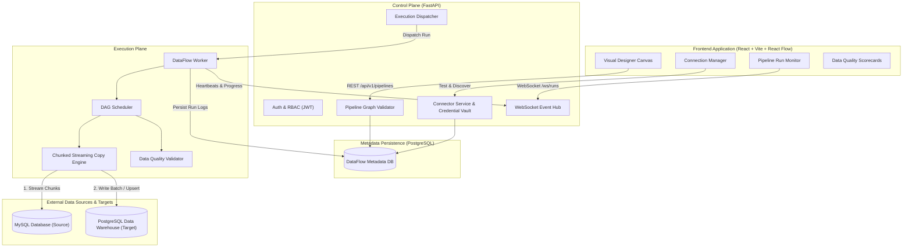
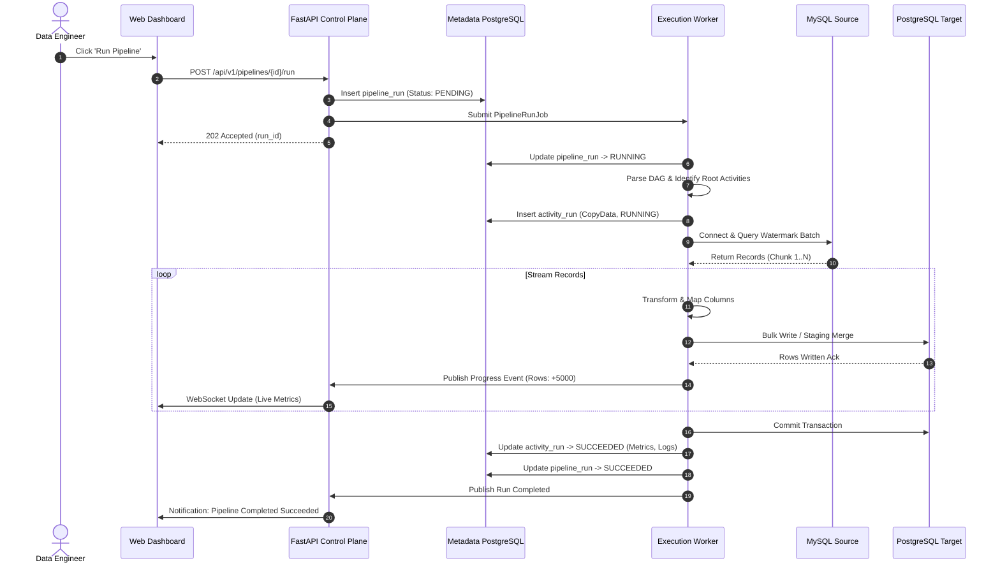

# DataFlow Enterprise — Architecture Diagrams

## 1. System Component Architecture

```mermaid
flowchart TD
    subgraph UI ["Frontend Application (React + Vite + React Flow)"]
        Canvas["Visual Designer Canvas"]
        ConnMgr["Connection Manager"]
        Monitor["Pipeline Run Monitor"]
        DQDashboard["Data Quality Scorecards"]
    end

    subgraph API ["Control Plane (FastAPI)"]
        AuthSvc["Auth & RBAC (JWT)"]
        PipeSvc["Pipeline Graph Validator"]
        ConnSvc["Connector Service & Credential Vault"]
        OrchSvc["Execution Dispatcher"]
        WSHub["WebSocket Event Hub"]
    end

    subgraph Storage ["Metadata Persistence (PostgreSQL)"]
        MetaDB[("DataFlow Metadata DB")]
    end

    subgraph ExecPlane ["Execution Plane"]
        Worker["DataFlow Worker"]
        TopSort["DAG Scheduler"]
        CopyEngine["Chunked Streaming Copy Engine"]
        DQEngine["Data Quality Validator"]
    end

    subgraph External ["External Data Sources & Targets"]
        MySQLSrc[("MySQL Database (Source)")]
        PGTarget[("PostgreSQL Data Warehouse (Target)")]
    end

    Canvas -->|"REST /api/v1/pipelines"| PipeSvc
    ConnMgr -->|"Test & Discover"| ConnSvc
    Monitor -->|"WebSocket /ws/runs"| WSHub
    PipeSvc --> MetaDB
    ConnSvc --> MetaDB
    OrchSvc -->|"Dispatch Run"| Worker
    Worker --> TopSort
    TopSort --> CopyEngine
    TopSort --> DQEngine
    CopyEngine -->|"1. Stream Chunks"| MySQLSrc
    CopyEngine -->|"2. Write Batch / Upsert"| PGTarget
    Worker -->|"Heartbeats & Progress"| WSHub
    Worker -->|"Persist Run Logs"| MetaDB
```

---

## 2. Activity Execution Sequence (Copy Data)

```mermaid
sequenceDiagram
    autonumber
    actor User as Data Engineer
    participant UI as Web Dashboard
    participant API as FastAPI Control Plane
    participant DB as Metadata PostgreSQL
    participant Worker as Execution Worker
    participant Src as MySQL Source
    participant Dst as PostgreSQL Target

    User->>UI: Click 'Run Pipeline'
    UI->>API: POST /api/v1/pipelines/{id}/run
    API->>DB: Insert pipeline_run (Status: PENDING)
    API->>Worker: Submit PipelineRunJob
    API-->>UI: 202 Accepted (run_id)

    Worker->>DB: Update pipeline_run -> RUNNING
    Worker->>Worker: Parse DAG & Identify Root Activities
    Worker->>DB: Insert activity_run (CopyData, RUNNING)

    Worker->>Src: Connect & Query Watermark Batch
    Src-->>Worker: Return Records (Chunk 1..N)
    loop Stream Records
        Worker->>Worker: Transform & Map Columns
        Worker->>Dst: Bulk Write / Staging Merge
        Dst-->>Worker: Rows Written Ack
        Worker->>API: Publish Progress Event (Rows: +5000)
        API->>UI: WebSocket Update (Live Metrics)
    end

    Worker->>Dst: Commit Transaction
    Worker->>DB: Update activity_run -> SUCCEEDED (Metrics, Logs)
    Worker->>DB: Update pipeline_run -> SUCCEEDED
    Worker->>API: Publish Run Completed
    API->>UI: Notification: Pipeline Completed Succeeded
```
